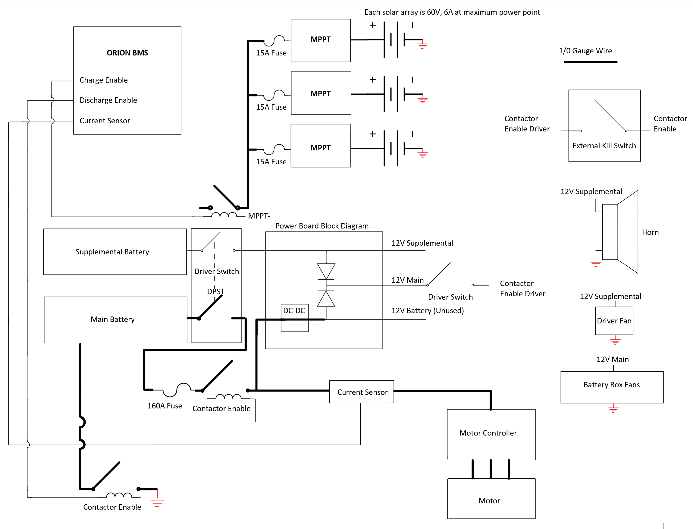
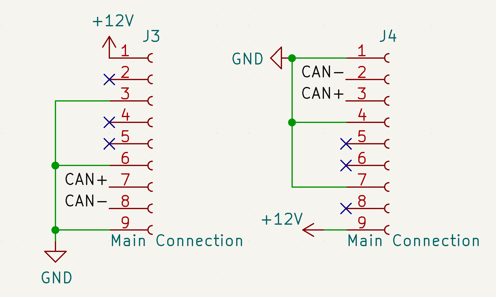

# Sunrider Schematic
Sunrider is the third iteration of UF's solar car. The schematic can be found below. 

### Basic Specifications
#### Battery
* Nominal Voltage: 96V
* Max Voltage: 109V
* Rated Capacity: 5 kWh

#### Solar Array
* RatedPower Output: ----

#### Motor
* Model: ----
* Rated Power Output: ----

### Connector Pinout
Sunrider uses 9-pin [male](https://www.molex.com/molex/products/part-detail/crimp_housings/0436450900) and [female](https://www.molex.com/molex/products/part-detail/pcb_headers/0436500900) connectors from Molex. These connectors are daisychained through all of the vehicle's PCBs. These connectors will not be used in future vehicles. The pinout for these connectors is shown below. 